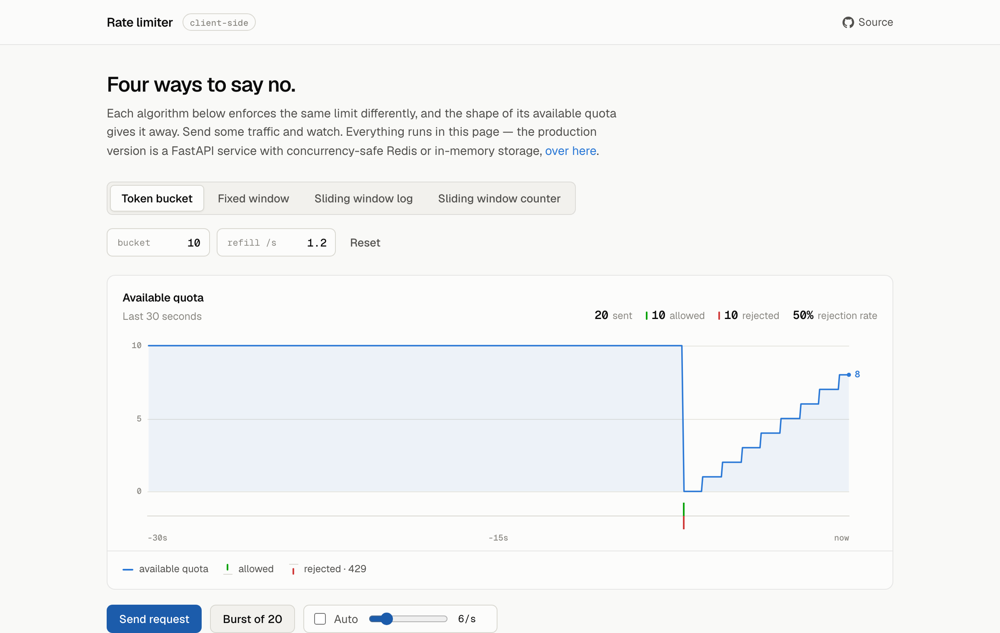

# API Rate Limiter

[](https://github.com/pranjalm37/api-rate-limiter/actions/workflows/ci.yml)
[](LICENSE)
[](https://pranjalm37.github.io/api-rate-limiter/)

Five rate limiting algorithms written without a rate limiting library, behind
one interface, with an in-memory or Redis backend. The demo page lets you fire
traffic at each one and watch what it does.

**[Try the live demo](https://pranjalm37.github.io/api-rate-limiter/)**



## Why it's built this way

**The algorithms behave differently, and you can see it.** Fixed window is the
cheapest to run, but a burst landing either side of a boundary gets through at
roughly twice the limit. A sliding window log is exact, at the cost of storing
every timestamp. A sliding window counter approximates the log for O(1). A
token bucket allows short bursts while still capping the long-run rate. GCRA
(the "leaky bucket") gets the same shape as a token bucket from a single
timestamp per key instead of an explicit token count -- no background refill
step, the math just falls out of comparing that timestamp to now. On the
demo page each one leaves a different shape: fixed window cliff-resets at the
boundary, a token bucket (or GCRA) ramps back up as it refills.

**Refill-then-consume is a race.** Two concurrent requests can both read the
same token count and both get allowed. Each backend does it as one atomic step
instead: an `asyncio.Lock` in memory, a Lua script in Redis. There's a test
that fires 50 concurrent requests at a 5-token bucket and checks that exactly
5 get through.

**The backend swaps without touching the algorithms.** Every limiter is
written against the `Store` interface in `app/storage/base.py`. The same
algorithm code runs in-process for a demo or against Redis across several
instances, and nothing in `app/limiters/` knows the difference.

**Reading quota can't cost quota.** The dashboard charts remaining quota over
time, so it needs a read with no side effects. If it used `check()` the chart's
own polling would count as traffic and skew what it was measuring. That's what
`peek()` is for, and there are tests asserting it never spends anything.

## Quickstart

```bash
pip install -r requirements.txt && uvicorn app.main:app --reload
```

Open <http://localhost:8000> for the dashboard, or `/docs` for the generated
OpenAPI reference. That runs entirely in-process with no external services.

For the Redis backend:

```bash
docker compose up --build
```

That brings up Redis alongside the API. Switch the store to `redis` in the
dashboard, or set `RATE_LIMITER_BACKEND=redis`.

## Layout

```
app/
  limiters/          the five algorithms, each with check() and peek()
    fixed_window.py
    sliding_window_log.py
    sliding_window_counter.py
    token_bucket.py
    gcra.py
  storage/           backends behind one Store interface
    memory.py        in-process, guarded by asyncio.Lock
    redis_store.py   Redis, with Lua scripts for the atomic operations
    gcra_store.py    separate interface for GCRA (state is one timestamp,
                      not a counter/sorted-set/token-count, per the Store methods)
    gcra_memory.py   in-process GCRA, guarded by asyncio.Lock
    gcra_redis.py    Redis-backed GCRA, atomic via a Lua script
  api/routes.py      /config, /limiter/check, /limiter/peek, /demo/resource
  limiter_manager.py the live configuration shared by the API and the UI
  main.py            FastAPI app, also serves the dashboard
docs/                static visualizer, published to GitHub Pages
frontend/            dashboard served by FastAPI, driving the real API
tests/               21 tests: per-algorithm, concurrency, peek, API
```

A request goes:

```
client ──▶ /api/demo/resource ──▶ LimiterManager.check(client_id)
                                        │
                                        ▼
                          RateLimiter (active algorithm)
                                        │
                                        ▼
                          Store (memory or redis), atomic ops
                                        │
                              allow 200 / deny 429 + Retry-After
```

## The algorithms

| Algorithm | Accuracy | Cost per key | Notes |
|---|---|---|---|
| Fixed window | Loose at edges | O(1) | Can pass ~2× the limit across a boundary |
| Sliding window log | Exact | O(requests in window) | Correct, but stores every timestamp |
| Sliding window counter | Approximate | O(1) | Weights two adjacent windows |
| Token bucket | Exact, burst-friendly | O(1) | What AWS API Gateway and Stripe use |

## API

| Endpoint | Method | Purpose |
|---|---|---|
| `/api/demo/resource` | GET | A protected endpoint, keyed on `X-Client-Id` or the caller's IP |
| `/api/limiter/check` | POST | Consume one unit of quota for a `client_id` |
| `/api/limiter/peek` | GET | Read remaining quota without consuming any |
| `/api/limiter/reset` | POST | Clear all limiter state |
| `/api/config` | GET/POST | Read or change the algorithm, backend, and limits |

When it rejects, `demo/resource` returns 429 with `Retry-After`,
`X-RateLimit-Limit` and `X-RateLimit-Remaining`, the same shape a real gateway
would send:

```bash
curl -i -H "X-Client-Id: demo" http://localhost:8000/api/demo/resource
```

## Two frontends

| | `frontend/` | `docs/` |
|---|---|---|
| Runs against | The real FastAPI service | Nothing, it's pure client-side JS |
| Hosted at | Wherever you run it | [GitHub Pages](https://pranjalm37.github.io/api-rate-limiter/) |
| Exists to | Show the whole system working, storage included | Show the algorithms without needing a server |

`docs/algorithms.js` ports the decision logic out of `app/limiters/*.py` with
the same math and the same edge cases, so the hosted page behaves like the real
thing with no backend. Both frontends share a stylesheet and self-host Geist
and Geist Mono (SIL OFL), so neither has an external dependency. Allowed and
rejected requests differ by tick direction as well as colour, because green and
red on their own aren't separable with red-green colour blindness.

To regenerate the screenshot after a design change:

```bash
python scripts/screenshot.py
```

## Tests

```bash
pytest tests/ -v
```

21 tests, no network or external services needed. They cover each algorithm's
limit and recovery behaviour, the concurrency guarantee, `peek()` not
consuming quota, and the API surface including 429 headers and validation. CI
runs them on every push, then builds the Docker image and checks the container
comes up healthy.

## Next

- Per-endpoint and per-tier limits instead of one global configuration
- Middleware so any route can be decorated rather than calling the limiter directly
- Prometheus metrics for allow and deny rates
- Benchmarks comparing the two backends under concurrent load

## License

MIT, see [LICENSE](LICENSE). The bundled Geist fonts are SIL OFL 1.1.
